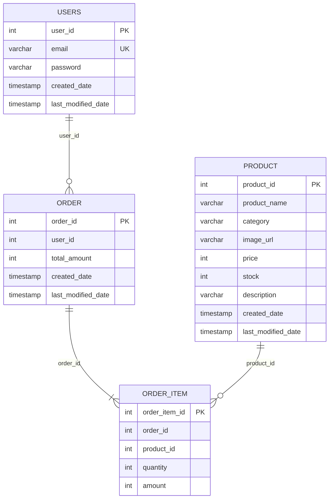

# 拾物 SHIWU E-Commerce

以 Spring Boot REST API 為核心、React 為操作介面的電商作品集。專案涵蓋商品瀏覽、會員 Session、購物車、訂單與商品管理 Demo，並刻意維持容易閱讀的前後端結構。

> 商品管理功能是 API 操作展示，不是正式後台。本專案依目前決策不實作 RBAC，因此商品新增、修改與刪除端點沒有管理員角色保護。

## 功能

### 消費者流程

- 首頁主打與最新商品
- 商品搜尋、分類、排序與分頁
- 商品詳情、庫存限制與售罄狀態
- `localStorage` 購物袋、數量調整與金額摘要
- 會員註冊、登入、登出與 Session 還原
- 結帳前重新檢查商品、價格與庫存
- 建立訂單與查看自己的訂單紀錄

### 商品管理 Demo

- 商品列表、搜尋、分類、排序與分頁
- 新增、修改與刪除商品
- 表單驗證、圖片預覽與操作狀態回饋
- CSRF 保護的寫入請求
- 介面持續揭露「未實作 RBAC」限制

## 技術架構

| 範圍 | 技術 |
|---|---|
| 前端 | React 19、JavaScript、Vite、React Router 8、Axios、React Context、Vitest |
| 後端 | Java 17、Spring Boot 4.0.6、Spring MVC、Spring Security、Spring JDBC、Maven |
| 資料庫 | MySQL；後端測試使用 H2 in-memory database |
| 驗證 | Spring Security Session、BCrypt、CSRF |

```text
瀏覽器（http://localhost:5173）
        │
        │ /api/*，Vite proxy 會移除 /api
        ▼
Spring Boot（http://localhost:8080）
        │
        ▼
MySQL（localhost:3306 / mall）
```

## 專案結構

```text
E-Commerce/
├── frontend/          # React 商城前台與商品管理 Demo
├── springboot-mall/   # Spring Boot API
├── docs/              # 設計規格、開發進度與圖片授權清冊
├── .agents/           # 專案開發 guardrails
└── README.md
```

詳細規格與進度：

- [前端設計與實作規格](docs/frontend-design-plan.md)
- [目前開發狀態](docs/development-status.md)
- [商品圖片授權清冊](docs/product-image-licenses.md)

## 後端資料夾結構

後端位於 `springboot-mall/`，採用 Controller → Service → DAO 分層。資料存取使用 Spring JDBC 與手寫 SQL，不是 JPA／Hibernate，因此 `model` 類別是承載查詢結果的 Java Bean，資料表關聯也不是透過 `@OneToMany` 等 annotation 建立。

```text
springboot-mall/
├── pom.xml
└── src/
    ├── main/
    │   ├── java/com/jerry/springbootmall/
    │   │   ├── SpringbootMallApplication.java  # 應用程式進入點
    │   │   ├── config/                         # Spring Security 設定
    │   │   ├── security/                       # UserDetails 與登入會員 Principal
    │   │   ├── controller/                     # HTTP API 與回應狀態
    │   │   ├── service/                        # 商業邏輯介面
    │   │   │   └── impl/                       # 商業邏輯實作
    │   │   ├── dao/                            # 資料存取介面
    │   │   │   └── impl/                       # JDBC SQL 實作
    │   │   ├── dto/                            # API 輸入與查詢條件
    │   │   ├── model/                          # 商品、會員、訂單資料模型
    │   │   ├── rowmapper/                      # SQL ResultSet 轉換為 model
    │   │   ├── constant/                       # 商品分類等固定值
    │   │   └── util/                           # 分頁等共用物件
    │   └── resources/
    │       └── application.properties          # MySQL 與 Session 設定
    └── test/
        ├── java/com/jerry/springbootmall/       # Controller 與整合測試
        └── resources/
            ├── application.properties          # H2 測試設定
            ├── schema.sql                      # 測試資料表定義
            └── data.sql                        # 測試初始資料
```

一般請求會依照以下方向流動：

```text
HTTP Request → Controller → Service → DAO
                                  ↓
                     NamedParameterJdbcTemplate
                                  ↓
                            MySQL／H2
```

- `controller/` 接收 HTTP request、驗證輸入並決定 HTTP status。
- `service/impl/` 處理商業規則，例如確認會員、檢查庫存、計算訂單金額。
- `dao/impl/` 使用 `NamedParameterJdbcTemplate` 執行查詢與寫入。
- `rowmapper/` 將每一列 SQL 結果轉換成 `Product`、`User`、`Order` 或 `OrderItem`。
- `dto/` 是 API 請求或查詢條件，不等同資料庫 table。
- `model/` 對應主要資料，但可能包含 JOIN 後才取得、並非實際 table 欄位的顯示資料。

## Database tables 與關聯

正式環境使用 MySQL 的 `mall` database，測試則使用 H2 in-memory database。版本庫目前可確認的 table 定義位於 `springboot-mall/src/test/resources/schema.sql`。

### `users`：會員

| 欄位 | 類型／限制 | 用途 |
|---|---|---|
| `user_id` | `INT`, PK, AUTO_INCREMENT | 會員識別碼 |
| `email` | `VARCHAR(256)`, UNIQUE, NOT NULL | 登入 Email |
| `password` | `VARCHAR(256)`, NOT NULL | BCrypt 密碼雜湊 |
| `created_date` | `TIMESTAMP`, NOT NULL | 建立時間 |
| `last_modified_date` | `TIMESTAMP`, NOT NULL | 最後修改時間 |

`User.password` 使用 `@JsonIgnore`，後端將 `User` 序列化為 JSON 時不會回傳密碼。

### `product`：商品

| 欄位 | 類型／限制 | 用途 |
|---|---|---|
| `product_id` | `INT`, PK, AUTO_INCREMENT | 商品識別碼 |
| `product_name` | `VARCHAR(128)`, NOT NULL | 商品名稱 |
| `category` | `VARCHAR(32)`, NOT NULL | 商品分類 enum 字串 |
| `image_url` | `VARCHAR(256)`, NOT NULL | 商品圖片網址 |
| `price` | `INT`, NOT NULL | 商品單價 |
| `stock` | `INT`, NOT NULL | 現有庫存 |
| `description` | `VARCHAR(1024)`, nullable | 商品描述 |
| `created_date` | `TIMESTAMP`, NOT NULL | 建立時間 |
| `last_modified_date` | `TIMESTAMP`, NOT NULL | 最後修改時間 |

### `order`：訂單主表

| 欄位 | 類型／限制 | 用途 |
|---|---|---|
| `order_id` | `INT`, PK, AUTO_INCREMENT | 訂單識別碼 |
| `user_id` | `INT`, NOT NULL | 下單會員 |
| `total_amount` | `INT`, NOT NULL | 訂單總金額 |
| `created_date` | `TIMESTAMP`, NOT NULL | 建立時間 |
| `last_modified_date` | `TIMESTAMP`, NOT NULL | 最後修改時間 |

因為 `order` 是 SQL 關鍵字，DAO 的 SQL 會以反引號寫成 `` `order` ``。Java `Order` 中的 `orderItemList` 不是 ORM 關聯，而是 Service 查出訂單後，再查詢明細並組裝。

### `order_item`：訂單明細

| 欄位 | 類型／限制 | 用途 |
|---|---|---|
| `order_item_id` | `INT`, PK, AUTO_INCREMENT | 明細識別碼 |
| `order_id` | `INT`, NOT NULL | 所屬訂單 |
| `product_id` | `INT`, NOT NULL | 購買商品 |
| `quantity` | `INT`, NOT NULL | 購買數量 |
| `amount` | `INT`, NOT NULL | 該項商品小計 |

`OrderItem` model 另外具有 `productName` 與 `imageUrl`。這兩個不是 `order_item` 欄位，而是 DAO 以 `order_item LEFT JOIN product` 查詢後提供給前端的顯示資料。

### Table 關聯圖



關聯可解讀為：

- 一位 `users` 會員可以擁有多筆 `order`。
- 一筆 `order` 包含一到多筆 `order_item`。
- 一項 `product` 可以出現在多筆 `order_item`。
- `order` 與 `product` 透過 `order_item` 形成多對多關係。

目前 `schema.sql` 只有保存關聯 ID，沒有宣告實體 `FOREIGN KEY` constraint；關聯完整性主要由後端 Service 維護。正式環境若要加上 foreign key 或導入 Flyway／Liquibase，應另外規劃 migration，不能直接對既有資料庫套用測試 schema。

### 建立訂單的資料流程

`OrderServiceImpl.createOrder()` 使用 `@Transactional`，將以下操作放在同一個 transaction：

1. 確認 `users` 中的會員存在。
2. 逐項查詢 `product`，確認商品存在且庫存足夠。
3. 扣除商品 `stock`，並以當下單價計算每筆 `order_item.amount`。
4. 加總金額並新增 `order`。
5. 使用新產生的 `order_id` 批次新增 `order_item`。

流程中若拋出例外，transaction 會回滾，避免只扣庫存卻沒有建立完整訂單。

## 環境需求

- Node.js `22.22.0` 以上（React Router 8 的最低需求）
- npm
- JDK 17
- Maven
- MySQL 8

目前沒有 Docker Compose 或 Maven Wrapper，請先在本機安裝上述工具。

## 本機啟動

### 1. 取得專案

```powershell
git clone https://github.com/asd185622/codex-E-commerce.git
cd codex-E-commerce
```

### 2. 建立 MySQL 資料庫

先建立名稱為 `mall` 的 UTF-8 資料庫：

```sql
CREATE DATABASE mall
  CHARACTER SET utf8mb4
  COLLATE utf8mb4_unicode_ci;
```

接著在 MySQL Workbench 或其他資料庫工具中，對 `mall` 執行 [測試用資料表定義](springboot-mall/src/test/resources/schema.sql)。這份檔案可建立目前 API 需要的四張資料表：

- `product`
- `users`
- `order`
- `order_item`

> `schema.sql` 開頭包含 `DROP TABLE IF EXISTS`，會刪除同名資料表與其中資料。只能用於全新資料庫或確定要重建的本機開發資料庫。`data.sql` 是自動化測試資料，不建議匯入一般開發資料庫。

目前專案尚未導入 Flyway 或 Liquibase，正式環境應改用版本化 migration，不應直接使用測試 schema 重建資料。

### 3. 設定並啟動後端

確認 [application.properties](springboot-mall/src/main/resources/application.properties) 的 MySQL 位址、帳號與密碼符合本機環境。不要將真實或正式環境密碼提交到 Git。

```powershell
cd springboot-mall
mvn spring-boot:run
```

後端預設啟動於 `http://localhost:8080`。

### 4. 啟動前端

另開一個 PowerShell 視窗：

```powershell
cd frontend
npm install
npm run dev
```

前端預設啟動於 `http://localhost:5173`。開發伺服器會把 `/api/*` 代理到 `http://localhost:8080/*`，因此應先啟動後端。

## 驗證與測試

### 前端

```powershell
cd frontend
npm test
npm run lint
npm run build
```

- `npm test`：Vitest 單次執行測試
- `npm run lint`：ESLint 靜態檢查
- `npm run build`：產生正式前端建置到 `frontend/dist/`
- `npm run test:watch`：開發時持續監看測試
- `npm run preview`：預覽已建置的前端

### 後端

```powershell
cd springboot-mall
mvn test
```

後端測試使用 H2 記憶體資料庫及 `src/test/resources` 下的 schema／測試資料，不會連線或寫入本機 MySQL `mall` 資料庫。

目前已驗證：

- 前端 13 個測試檔、49 個測試案例通過
- 前端 lint 與正式建置通過
- 後端 34 個測試通過
- 正式環境 npm 相依性 0 項已知漏洞

## Session、CSRF 與權限界線

- 登入狀態保存在伺服器端 Session，瀏覽器 Cookie 名稱為 `SHIWU_SESSION`。
- Session 有效時間為 30 分鐘，Cookie 使用 HttpOnly 與 SameSite=Lax。
- 密碼使用 BCrypt 雜湊；會員身分不保存在 `localStorage`。
- 前端啟動時透過 `GET /users/me` 還原會員資料。
- 非 GET 請求會先由 `GET /csrf` 取得 CSRF token，再使用後端指定的 header 送出。
- 訂單端點會比對 URL 中的 `userId` 與目前 Session 會員，避免跨會員讀寫訂單。
- 本專案不實作 RBAC。商品管理路由及寫入 API 只能作為 Demo，不能視為正式管理員授權。

## API 摘要

後端端點沒有 `/api` 前綴；`/api` 只存在於前端開發代理。

| 方法 | 路徑 | 用途 | 登入需求 |
|---|---|---|---|
| `GET` | `/products` | 商品列表、搜尋、分類、排序與分頁 | 否 |
| `GET` | `/products/{productId}` | 商品詳情 | 否 |
| `POST` | `/products` | 新增商品 Demo | 否；需 CSRF |
| `PUT` | `/products/{productId}` | 修改商品 Demo | 否；需 CSRF |
| `DELETE` | `/products/{productId}` | 刪除商品 Demo | 否；需 CSRF |
| `POST` | `/users/register` | 註冊 | 否；需 CSRF |
| `POST` | `/users/login` | 登入 | 否；需 CSRF |
| `POST` | `/users/logout` | 登出 | 是；需 CSRF |
| `GET` | `/users/me` | 目前會員 | 是 |
| `GET` | `/csrf` | 取得 CSRF token | 否 |
| `POST` | `/users/{userId}/orders` | 建立自己的訂單 | 是；需 CSRF |
| `GET` | `/users/{userId}/orders` | 查詢自己的訂單 | 是 |

## 前端頁面

| 路徑 | 頁面 |
|---|---|
| `/` | 商城首頁 |
| `/products` | 商品列表 |
| `/products/:productId` | 商品詳情 |
| `/cart` | 購物袋與結帳 |
| `/login` | 登入 |
| `/register` | 註冊 |
| `/orders` | 我的訂單 |
| `/admin/products` | 商品管理 Demo |
| `/admin/products/new` | 新增商品 Demo |
| `/admin/products/:productId/edit` | 修改商品 Demo |

## 已知限制

- 不提供 RBAC 或管理員角色；管理功能僅供作品展示。
- 不包含真實金流、配送地址、優惠券、收藏、評論或第三方登入。
- 後端既有商品仍保存舊外部 `imageUrl`；前端會將已盤點的 8 個網址替換成專案內原創素材，尚未進行資料庫遷移。
- 目前沒有圖片上傳服務，商品表單使用 `imageUrl`。
- 目前沒有 Docker、CI/CD 或正式資料庫 migration。
- 開發工具維持目前可正常測試與建置的版本，不規劃只為清除 dev-only audit 警告而進行主要版本升級。

## 專案定位

這是一個以後端 API、安全流程與資料操作為重點的求職作品集。React 前端用來完整呈現 API 能力，但不刻意加入大型狀態管理或 UI 框架，以保留清楚、容易說明的程式結構。
